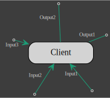

# Actors

An actor is composed on 3 elements:

 * a set of inputs,
 * a set of outputs,
 * a client.

 Both outputs and inputs are optional but an actor must have at least either one input or one output.
 Inputs and outputs may be sampled at a different rate, but the rate must be the same for all inputs and for all outputs.

 

An actor runs within its own thread independently of other actors and perform 3 functions:

 1. collect and read inputs into the client,
 2. update the state of the client,
 3. write and distribute the outputs from the client to other actors.

These 3 functions are excuted sequentially within a loop.

A client must comply with the definition of the actor interface.
The interface consists in 3 traits: `Update`, `Read` and `Write`.
A client must:
 * implement the `Update` trait,
 * have an implementation of the `Read` trait for each input,
 * have an implementation of the `Write` trait for each output.

Actor inputs and outputs are given a unique type, usually an empty Enum.
Each input and output must implement the `UniqueIdentifier` trait which associated type `DataType` is set to the primitive type of the client data.

As an example, lets write an interface for a client which task is to multiply an integer by e.
 Lets define
 
  * the client:
 ```rust,no_run,noplayground
{{#include ../../examples/book/main.rs:client}}
 ```
  * the input `In`:
 ```rust,no_run,noplayground
{{#include ../../examples/book/main.rs:client_in}}
 ```
   * the output `Out`:
 ```rust,no_run,noplayground
{{#include ../../examples/book/main.rs:client_out}}
 ```
Each input and output is given a unique type (here an empty `Enum`) that implements the `UniqueIdentifier` trait with the derive macro `UID`. 
The input/ouput primitive types (`i32` for the input and `f32` for the ouput) are affected to the associated type `DataType` of the `UniqueIdentifier` traits.

And now lets build the interface:
  * update is empty, this simple task can be done at the output
```rust,no_run,noplayground
{{#include ../../examples/book/main.rs:client_io_update}}
```
 * read input
```rust,no_run,noplayground
{{#include ../../examples/book/main.rs:client_io_read}}

```
 * write output
```rust,no_run,noplayground
{{#include ../../examples/book/main.rs:client_io_write}}
```

Actors exchange their clients data that is contained inside the structure `Data`. 
The type of the client data can be anything as long as the input that receives it or the output that sends it, implements the `UniqueIdentifier` trait.

Once the actor to client interface has been written, the client can then be used to build an actor.
Here is the signature of the `Actor` type:
```rust,no_run,noplayground
struct Actor<C, const NI: usize = 1, const NO: usize = 1> where C: Update
```
An actor takes 3 generic type parameters: 
 * `C`: the type of the client,
 * `NI`: the sampling rate of the inputs,
 * `NO`: the sampling rate of the outputs.

Sampling rates are given as ratio between the simulation sampling frequency and the actor inputs or outputs sampling frequency.
The where clause required that the client implements the `Update` trait, meaning that anything can be an actor's client as long as it implements the `Update` trait.

Actors implements the [From](https://doc.rust-lang.org/std/convert/trait.From.html) trait for any type that implements the `Update` trait. 
As a consequence, a client can be converted into an actor with:
```rust,no_run,noplayground
let actor = Actor::<Client,1,1>::from(client);
```
When using the default value (1) for the inputs and outputs rate, they can be omitted:
```rust,no_run,noplayground
let actor = Actor::<Client>::from(client);
```
In that case, the compiler is also able to infer the client type:
```rust,no_run,noplayground
let actor = Actor::<_>::from(client);
```
or we can use the [Into](https://doc.rust-lang.org/std/convert/trait.Into.html) syntax:
```rust,no_run,noplayground
let actor: Actor::<_> = client.into();
```

An actor with no inputs must set `NI` to 0 or use the type alias `Initiator` defined as `Initiator<C, const NO: usize = 1> = Actor<C, 0, NO>`:
```rust,no_run,noplayground
let no_input_actor = Initiator::<_>::from(client);
```
An actor with no outputs must set `NO` to 0 or use the type alias `Terminator` defined as `Terminator<C, const NI: usize = 1> = Actor<C, NI, 0>`:
```rust,no_run,noplayground
let no_output_actor = Terminator::<_>::from(client);
```

The conversion methods `from` and `into` consume their arguments meaning that the client is no longer available once the actor has been created.
This is not always desirable, instead the `new` method of  `Actor` can be used to pass a reference to the client into an actor.

It is worth noting that all the inputs and outputs of an actor will also be given a copy of the reference to the client in order to pass data to it and to get data from it.
And because an actor performs many of its own tasks asynchronously, a client must first be wrapped into the thread-safe smart pointers [Arc](https://doc.rust-lang.org/std/sync/struct.Arc.html) and [Mutex](https://doc.rust-lang.org/std/sync/struct.Mutex.html) like so
```rust,no_run,noplayground
let thread_safe_client = Arc::new(Mutex::new(client));
```
followed by the actor declaration
```rust,no_run,noplayground
let actor = Actor::new(thread_safe_client);
```
Note that all types that implements the `Update` trait can be converted into a thread safe type with
```rust,no_run,noplayground
let thread_safe_client = client.into_arcx();
```