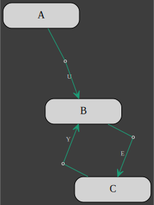
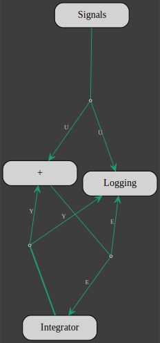
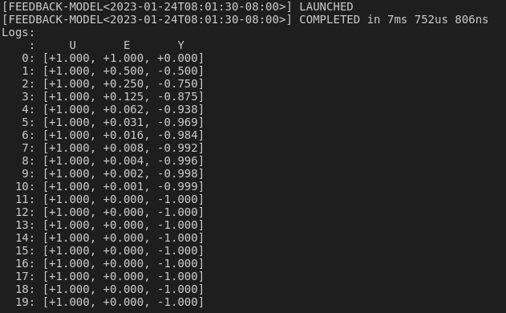

# Feedback System

A feedback system is a system with a feedback loop:



Such a system with a direct feedthrough from C to B is also known as an algebraic loop.
It is a singular system as shown with the sequence of events:

|| A | B | C |
|-:|---|---|---|
|1| `Update` | - | - |
|2| `Write::<U>` | - | - | 
|3| - | `Read::<U>` | - |

After step 3, the system cannot progress: B is waiting for  Y from C before sendind E to C, while at the same time, C is waiting for E from B before sending Y to B.

In order to resolve the conflict, we can bootstrap the system but having C sending a default value for Y at the start of the simulation:

|| A | B | C |
|-:|---|---|---|
|1| `Update` | - | `Write::<Y>` |
|2| `Write::<U>` | - | - | 
|3| - | `Read::<U,Y>` | - |
|4| `Update` | `Update` | - |
|5| `Write::<U>` | `Write::<E>` | - |
|6| - | - | `Read::<E>` |
|7| - | `Read::<U>` | `Update` |
|8| `Update` | - | `Write::<Y>` |
|9| `Write::<U>` | `Read::<Y>` |
|10| - | `Update` | - |
|11| ...

`gmt_dos-actors` implements such bootstrapping method for feedback system like the kind of system with an integral controller.

[`Integrator`][integrator] is the client that performs the functions of an integral controller.
It continuously integrates the negative of the input (weighted by the gain of the controller) and returns the integral. 

An actor for a scalar integrator with a gain of 0.5 is declared with
```rust,no_run,noplayground
{{#include ../../../../examples/feedback.rs:integrator}}
```
Lets add a constant signal and a logger to the model:
```rust,no_run,noplayground
{{#include ../../../../examples/feedback.rs:signal}}
{{#include ../../../../examples/feedback.rs:logging}}
```
The client of the last actor to be added to the model, sums the signal and the feedback from the integral controller:
```rust,no_run,noplayground
{{#include ../../../../examples/feedback.rs:sum}}
```

Lets define the types for inputs and outputs:
```rust,no_run,noplayground
{{#include ../../../../examples/feedback.rs:io}}
```

The connections are defined with, for the feedthrough:
```rust,no_run,noplayground
{{#include ../../../../examples/feedback.rs:feedthrough}}
```
and for the feedback with the bootstrapping of `Y`:
```rust,no_run,noplayground
{{#include ../../../../examples/feedback.rs:feedback}}
```
The model is:
```rust,no_run,noplayground
{{#include ../../../../examples/feedback.rs:model}}
```


Note the bolder line for the `Y` output (this is how the bootstrapped outputs are always drawn).

The logged data is
```rust,no_run,noplayground
{{#include ../../../../examples/feedback.rs:log}}
```


#### Implementation of the `Sum` client:
```rust,no_run,noplayground
{{#include ../../../../examples/feedback.rs:sum_client}}
```

[integrator]: https://docs.rs/gmt_dos-actors/latest/gmt_dos_actors/clients/struct.Integrator.html