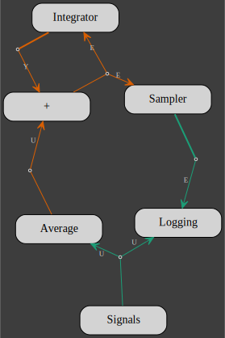
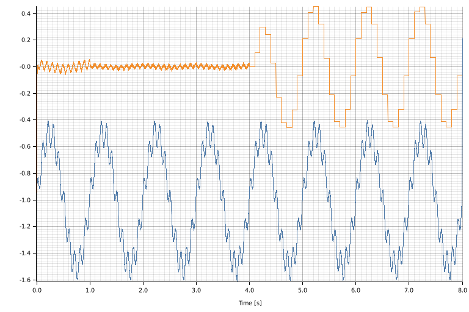

# Persistence

Persistence refers to the notion that the state of a client persists during and after a model execution.
We have already witnessed the persistence of the clients in the previous section with the `Logging` clients from which data is processed after the models have been terminated.

In the following, we are going to make use of this property of the clients to update a model at different stage of its execution.

The model is a feedback loop system which is bootstrapped with a low gain (0.2) for 1s, then the gain is increased to 0.5 for another 3s and finally the sampling rate of the feedback loop is reduced to 1/10th for the rest of the simulation. 

Lets first define the simulation sampling frequency (1kHz) and the durations of the 3 stages of the simulation:
```rust,no_run,noplayground
{{#include ../../../../examples/persistence.rs:params}}
```
The parameters above are used to defined the number of samples for each stage:
```rust,no_run,noplayground
{{#include ../../../../examples/persistence.rs:stage_n_step}}
```

The input signal is the sum of 3 signals: 2 sinusoides and some white noise:
```rust,no_run,noplayground
{{#include ../../../../examples/persistence.rs:signal}}
```
Next we set the other 2 persistent clients for:
 * the feedback integral control with the gain set to default (0)
```rust,no_run,noplayground
{{#include ../../../../examples/persistence.rs:integrator}}
```
 * and data logging 
```rust,no_run,noplayground
{{#include ../../../../examples/persistence.rs:logging}}
```

For stage I and II, the models are the same, only the gain of the integral controller is updated to 0.2 for stage I and to 0.5 for stage II.
So we define a [closure](https://doc.rust-lang.org/rust-by-example/fn/closures.html) to build the model template for stage I and II:
```rust,no_run,noplayground
{{#include ../../../../examples/persistence.rs:closure}}
```
The only argument to the closure is the duration `n` of each stage.
In addition to the actors of the `signal`, `integrator` and `logging` clients, actors for the `Timer` and the `Sum` clients were added.
The `Sum` client is the same that the one introduces in the [FeedBack System](../feedback/feedback.md) section.

The model for stage I and II looks like this:


## Stage I

For stage I, we create the model with the appropriate duration, set the integrator gain and run the model:
```rust,no_run,noplayground
{{#include ../../../../examples/persistence.rs:stage_i}}
```

## Stage II

For stage II, we also start by creating the model with the appropriate duration, then we wait for stage I to finish before setting the integrator gain and running the model with the updated gain:
```rust,no_run,noplayground
{{#include ../../../../examples/persistence.rs:stage_ii}}
```

## Stage III

For stage III, the feedback loop sampling rate is reduced by a factor 10:
```rust,no_run,noplayground
{{#include ../../../../examples/persistence.rs:stage_iii_feedback_rate}}
```
The input signal is average over 10 samples and the output signal is upsampled by a factor 10 as well.
Considering the above, the stage III actors are:
```rust,no_run,noplayground
{{#include ../../../../examples/persistence.rs:stage_iii_actors}}
```
We removed the `Timer` client and added actors for the `Average` and `Sampler` clients and we are still using the same `Signals`, `Integrator` and `Logging` clients but in the state they will be at the end of stage II.

The stage III network is build next:
```rust,no_run,noplayground
{{#include ../../../../examples/persistence.rs:stage_iii_network}}
```
and we create the new model, waiting for stage II to finish before running it:
```rust,no_run,noplayground
{{#include ../../../../examples/persistence.rs:stage_iii_model}}
```


