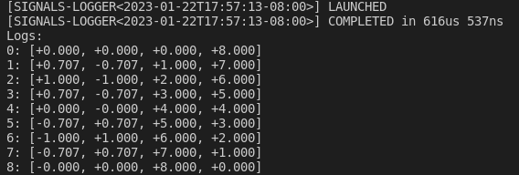
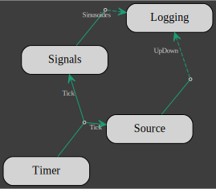

# Signals & Logger

In the following, we will introduce the [`signals`][signals], [`Source`][source], [`Logging`][logging] and [`Timer`][timer] clients.

Both [`Signals`][signals] and [`Source`][source] are signals generators and
both are multi-channels with a single multiplexed output.

The signals generated with `Signals` are either a constant, a sinusoide, a ramp, a sinusoide or white-noise. For example, here is an `Actor` which client is a 2 channels `Signals`, each channel with the same sinusoide but out-of-phase:
```rust,no_run,noplayground
    {{#include ../../../../examples/signals.rs:n_step}}
{{#include ../../../../examples/signals.rs:signals}}
```

`Source` signals are user provided, the multiplexed channels are given as a single flatten vector argument:
```rust,no_run,noplayground
{{#include ../../../../examples/signals.rs:source}}
```

The [`Logging`][logging] client simply accumulates all its inputs into a single vector. `Logging` requires all inputs signals to be of the same type. 
An actor for a `Logging` client with entries for both the `Signals` and `Source` clients is declared with
```rust,no_run,noplayground
{{#include ../../../../examples/signals.rs:logging}}
```

Building a `Model` out of the 3 actors:
```rust,no_run,noplayground
{{#include ../../../../examples/signals.rs:io}}

{{#include ../../../../examples/signals.rs:model}}
```
gives:


and the following data has been logged:
```rust,no_run,noplayground
{{#include ../../../../examples/signals.rs:logs}}
```


The [`Timer`][timer] client does not generate a new signal instead it adds a beat to the model and takes as input argument a number of beat. 
A `Model` with a timer will terminate after the last beat.
Lets update the previous `Model` with a timer which number of beat is half the number of sample that the signals clients are set to generate:
```rust,no_run,noplayground
{{#include ../../../../examples/signals.rs:timer}}
```
The `signals` and `source` clients are modified to accept the `timer` input:
```rust,no_run,noplayground
{{#include ../../../../examples/signals.rs:signals_and_source}}
```
`logger` remains the same and the timer is connected to both `signals` and `source`:
```rust,no_run,noplayground
{{#include ../../../../examples/signals.rs:timer_signals_source}}
```
Note that for a client to allow `Timer` as input, it must implement the `TimerMarker` trait.
The new model looks like this:
```rust,no_run,noplayground
{{#include ../../../../examples/signals.rs:model_with_timer}}
```


and the following data has been logged:
```rust,no_run,noplayground
{{#include ../../../../examples/signals.rs:trunc-logs}}
```


[signals]: https://docs.rs/gmt_dos-actors/latest/gmt_dos_actors/clients/struct.Signals.html
[source]: https://docs.rs/gmt_dos-actors/latest/gmt_dos_actors/clients/struct.Source.html
[logging]: https://docs.rs/gmt_dos-actors/latest/gmt_dos_actors/clients/struct.Logging.html
[timer]: file:///media/rconan/projects/target/doc/gmt_dos_actors/clients/struct.Timer.html