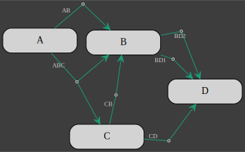

# Model

A model is a network of clients connected to each other by pairs of output/input.
The actor/client interfaces specify the tasks that are going to be executed and the topology of the network defines the order in which the tasks are executed.

A pair of output/input defines a unique [channel](https://docs.rs/flume/latest/flume/)  with a sender and a receiver.
The sender is given to the output and the receiver to the input. 

Each actor performs the following task sequentially in a never ending inner loop and asynchronously with respect to the other actors :
 1. if any inputs, receive inputs & invoke client `Read` trait implementation on each input,
 2. update client state with the client `Update` trait implementation,
 3. if any outputs, invoke the client `Write` trait implementation on each output & send outputs.

 The default behavior of an actor is to pause the inner loop both until all the inputs have been received and until all the outputs have been received by other actors.

 

In the model above, the network topology imposes the following sequence of events (from top to bottom):

|| A | B | C | D |
|-:|---|---|---|---|
|1| `Update` | - | - | - |
|2| `Write::<AB,ABC>`| - | - | - |
|3| - | `Read::<AB,ABC>` | `Read::<ABC>` | - |
|4| `Update` | - | `Update` | - |
|5| `Write::<AB,ABC>` | - | `Write::<CB,CD>` | - | 
|6| - | `Read::<CB>` | - | `Read::<CD>` |
|7| - | `Update` | `Read::<ABC>` | - |
|8| - | `Write::<BD1,BD2>` | `Update` | - |
|9| - | - | `Write::<CB,CD>` | `Read::<BD1,BD2>` |
|10| - | `Read::<AB,ABC,CB>` | - | `Update` |
|11| `Update` | `Update` | - | `Read::<CD>` | 
|12| ...

Note that events in the same row may occur simultaneously thanks to the asynchronous nature of the actors.

Laying out the network consists in building actors outputs and relaying them to other actors inputs.
A pair of output and input must meet the following requirements:
 * the client of the output actor must implement the trait `Write<I>`
 * the client of the input actor must implement the trait `Read<O>`
 * `I` and `O` must be of the same type i.e. `I=O`
 * the ouput rate `NO` must be equal to the input rate `NI` (`NO=NI`)

A model will not compile in any of the above requirements is not met.

 For client `A` that gives:
 ```rust,no_run,noplayground
A.add_output().build::<AB>().into_input(&mut B);
A.add_output().multiplex(2).build::<ABC>()
    .into_input(&mut B)
    .into_input(&mut C);
 ```
As illustrated above, an output can be multiplexed and sent to multiple inputs.

Then for `B`:
 ```rust,no_run,noplayground
B.add_output().build::<BD1>().into_input(&mut D);
B.add_output().build::<BD2>().into_input(&mut D);
 ```
and `C` :
  ```rust,no_run,noplayground
C.add_output().build::<CB>().into_input(&mut B);
C.add_output().build::<CD>().into_input(&mut D);
 ```
Per default, an actor inner loop is blocked until all its outputs have been read by the associated inputs as a guarantee that the data has been effectively received.

This is not always necessary, particulary for a client that acts as a data sink like `D`.
The links to `D` can be rewritten:
 ```rust,no_run,noplayground
B.add_output().unbounded().build::<BD1>().into_input(&mut D);
B.add_output().unbounded().build::<BD2>().into_input(&mut D);
C.add_output().unbounded().build::<CD>().into_input(&mut D);
 ```
and the outputs `BD1`, `BD2` and `CD` won't block their actors inner loop anymore.

Once all the connections have been set-up, we can assemble the actors into a model:
 ```rust,no_run,noplayground
let mut model = Model::new(vec![Box::new(A),Box::new(B),Box::new(C),Box::new(D)]);
```
check the model for errors, run it and wait for it to finish:
 ```rust,no_run,noplayground
model.check()?.run().await?;
```
Note that the `run` method cannot be invoked on an unchecked model.

A flow chart of the model can be obtained with the `flowchart` method, combining all the `Model` methods in a single call gives:
 ```rust,no_run,noplayground
Model::new(vec![Box::new(A),
                Box::new(B),
                Box::new(C),
                Box::new(D)])
    .flowchart()
    .check()?
    .run()
    .await?;
```
The flowchart is written to the file `integrated_model.dot.svg`.

When an output detects that the data the client has written to its buffer is `None`, it closes the channel it belongs to and return an error to the actor that forces the actor to shut down.

When an actor shuts down its inputs and outputs close the channels they are part of.
A closed channel also generates an error that is caught by the actors at both end of the channel and forces these actors to also shut down and so, by a domino effect, all the actors are terminated and the model gracefully comes to an end.

## Working example 

Building upon the example in the previous section, lets add 2 more clients:

 * a random generator
```rust,no_run,noplayground
{{#include ../examples/actors-model.rs:rand_gen}}
```
 * a data logger
```rust,no_run,noplayground
{{#include ../examples/actors-model.rs:data_log}}
```

 With all the clients defined with an actor/client interface, the actors are instanciated with
```rust,no_run,noplayground
{{#include ../examples/actors-model.rs:actors}}
```
Each actor requires 3 generic type parameters: the client type and 2 constants: the inputs and outputs sampling rates.
The inputs rate is zero if the actor has no inputs and the outputs rate is zero if the actor has no outputs.
The default sampling rate for inputs and outputs is 1.

The next step is to build the network. The links between actors are established by successively creating channels between an actor output and the input of another actor, both the output and the input must have been given the same type and the same sampling rate. 
```rust,no_run,noplayground
{{#include ../examples/actors-model.rs:actors_network}}
```
Now the model can be assembled, charted, checked for errors and run:
```rust,no_run,noplayground
{{#include ../examples/actors-model.rs:model}}
```


The model stop itself when the data from the `RandGen` client is exhausted.

